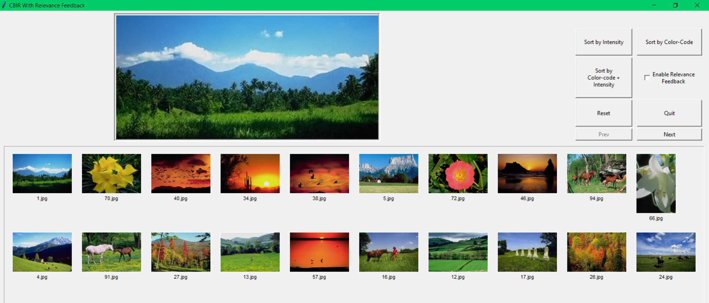
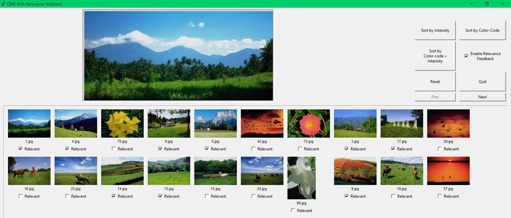

# CBIR-Relevance-Feedback

## How to Run
1.	After decompressing the .zip file, go into the unzipped folder
2.	Put the desired images into the “images” folder.
3.	Make sure to have Python3 installed and also have `Pillow`, `numpy`, `scikit-learn` and `pandas` libraries installed.
4.	At the root of the unzipped folder, do `python3 ImageViewer.py`. Wait a few seconds (depending on the system configuration) for it to load up.

### Application opens:

### Sort by Intensity:

### Sort by Color:

### Color-code+Intensity without RF: 
  
 
### After selecting all the relevant images:

### Sort by Color-code+Intensity with RF:
